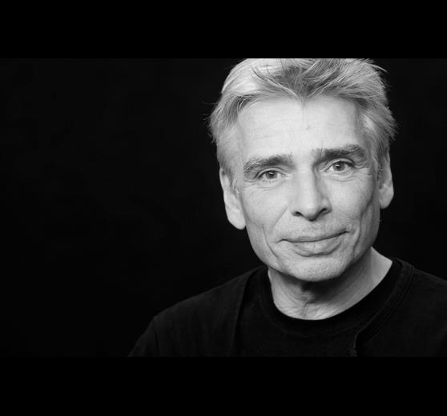

# Robert Peter Zieger - Leben und Wirken

Dieses Projekt ist dem deutschen Künstler, Techniker und Lichtdesigner Robert "Robbie" Peter Zieger (1955-2021) gewidmet, der für seine bedeutenden Beiträge zur Veranstaltungstechnik und insbesondere für die Entwicklung eines rechnergesteuerten Hubzugsystems bekannt war.

## Inhalt

### Biografie von Robert Peter Zieger

Robert Peter Zieger, bekannt als Robbie, wurde am 2. März 1955 in Lippstadt geboren und verstarb am 19. August 2021 in Hagen. Er war ein deutscher Techniker und Lichtdesigner, der bedeutende Beiträge zur Entwicklung von Veranstaltungstechnik sowohl in Deutschland als auch weltweit leistete.

Er wohnte Ende der 80er Jahre im Stadt-Teil __Hagen-Wehringhausen__ in direkter Nachbarschaft der B 56 und war in dieser Zeit aktiv als Roadie und Tonmischer für die Hagener Band __Extrabreit__ tätig. Robbie war dabei sowohl deren Roadie als auch Tonmischer, u.a. beim Auftritt der Band auf dem 1. Stadtteilfest in Wehringhausen 1979.

Im Laufe seiner Karriere erlangte Robbie umfassende Kenntnisse in Licht-, Ton- und Bühnentechnik und arbeitete ab 1984 für die IF-Show-Service GmbH.

---

### Erfinder und Designer

Robbie ist bekannt als der Erfinder eines rechnergesteuerten Hubzugsystems mit mindestens zwei Hubzügen, das besonders für Bühnen und Mehrzweckhallen geeignet ist. Diese Erfindung wurde 1996 patentiert und machte ihn zu einem __Pionier__ in der Veranstaltungstechnik.

Das von ihm entwickelte __Tracking-System__ wurde in den frühen 90er Jahren in verschiedenen großen Veranstaltungen eingesetzt, darunter die ZDF-Pop-Shows in der Dortmunder Westfalenhalle.

Robbie war auch maßgeblich an der Entwicklung und dem Betrieb von fest installierten Hub-Zug-Anlagen, wie z.B. in der Grugahalle, beteiligt.

---

### Projekte und Arbeiten

Robert Peter Zieger war an einer Vielzahl von Veranstaltungen beteiligt, darunter:

- __Extrabreit:__ Robbie war als Roadie und Tonmischer für die Band tätig, insbesondere beim Auftritt auf dem 1. Stadtteilfest in Wehringhausen 1979.
- __Peters Pop Show:__ und __RTL-Löwenverleihung:__ Über die Show Design GmbH war er für die technische Durchführung dieser Großveranstaltungen verantwortlich.
- __ZDF-Pop-Shows:__ In den Jahren 1991-1993 war Robbie maßgeblich an der Durchführung dieser Shows in der Dortmunder Westfalenhalle beteiligt, bei denen sein patentiertes Tracking-System zum Einsatz kam.

---

### Quellen

- Traueranzeige. In: trauer-im-vest.de. 28. August 2021, abgerufen am 4. Januar 2021.
- European publication server. In: Internetseite der Europäischen Patentorganisation. 27. Dezember 1996, abgerufen am 3. Januar 2022.
- Kai Havaii: Hart wie Marmelade – Ein Rock’N’Roll–Roman aus der Provinz. ISBN 978-3-8375-1865-8.

---
